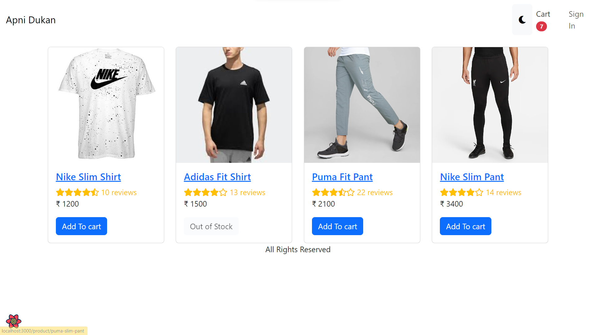
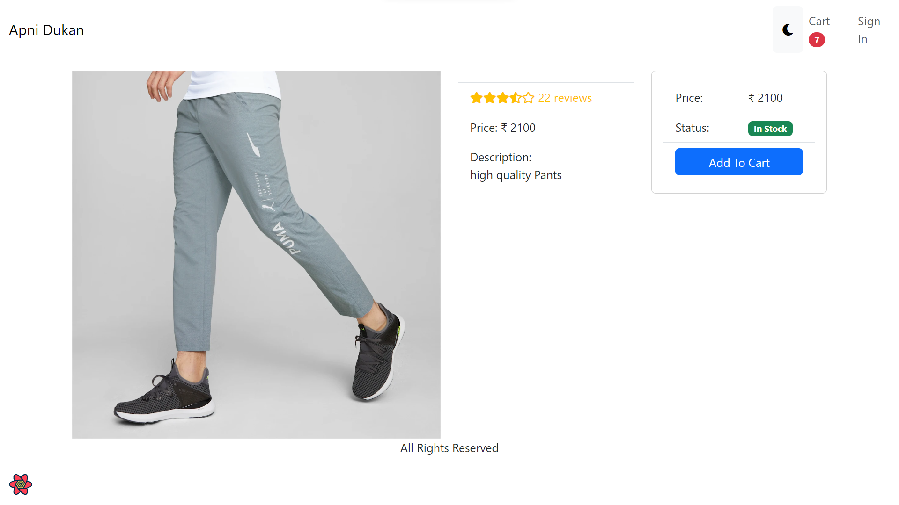
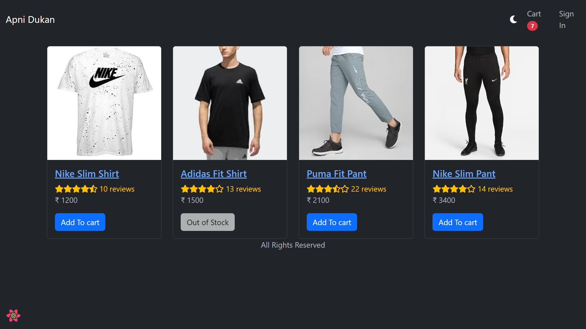
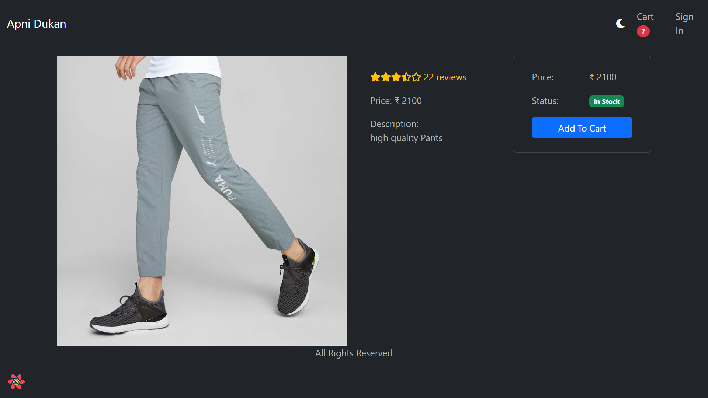

# Amazon_Clone-TS-ReactJS-

## Welcome to Apni Dukan (Amazon Clone)

## >>> "Work In Progress" <<<

<h3>React + TypeScript to build a fully-functional e-commerce website similarly like Amazon. An e-commerce website using MERN stack (MongoDB, ExpressJS, React and Node.JS).
</h3>

# Deployed URL 👉 [Click here](https://frontend-jade-nine.vercel.app/)

- Rushi Joshi   (My Linkedin profile :- https://www.linkedin.com/in/rushijoshi3798/)  
              (My Portfolio :- https://rushijoshi3798.github.io/)
   
  
- Source Code(GitHub link):- https://github.com/Rushijoshi3798/Amazon_Clone-TS-ReactJS-

 
<h4 align="center">💻 Tech Stack</h4>
 

 
 
 
 
   
  
 
 
 

 

<h3 align="center">Tools</h3> 
  
  
   
    

 

## Let's Dive into What we have made

## Pages :

## Pages - Dark Mode :

## Done & Dusted
- Created react application in TypeScript
- Created e-commerce pages like Products, singleProduct, cart using React Router Dom
- React hooks to handle form inputs and fetch backend api
- Managed and monitor application state by React's "useContext"
- Handling shopping cart using reducers and local storage

## Upcoming Plan
- Building backend web api by node.js, express.js and MongoDB
- Will Create remaining e-commerce pages like checkout and place order using React Router Dom
- Defining and exporting Types like product, orders and user in frontend
- Will Handle authentication and authorization using JsonWebToken and express middleware.
- Will Deploy application on cloud servers like Render
- Will try to learn & add Mailgun to email order receipt to user

## >>> "Work In Progress" <<<

## Show your support

Give a ⭐️ if you like this project!

### Thank you
